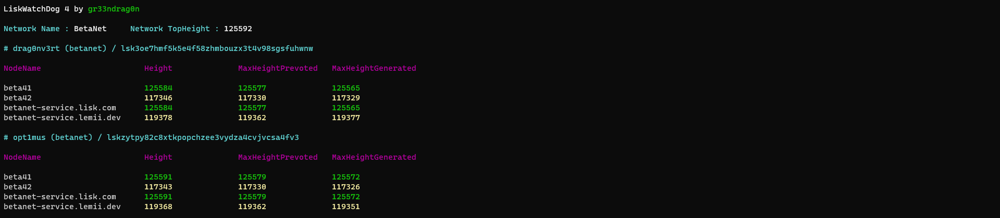

# Show-GeneratorLastBlock

**przemer** : `"delegate should always pick the local data, unless its somehow lower than on service"`

Show Validator/Generator Last Block Heights Information

## Usage Example:

```powershell
.\Show-GeneratorLastBlock.ps1 -Net Beta
```

## Output Example:


